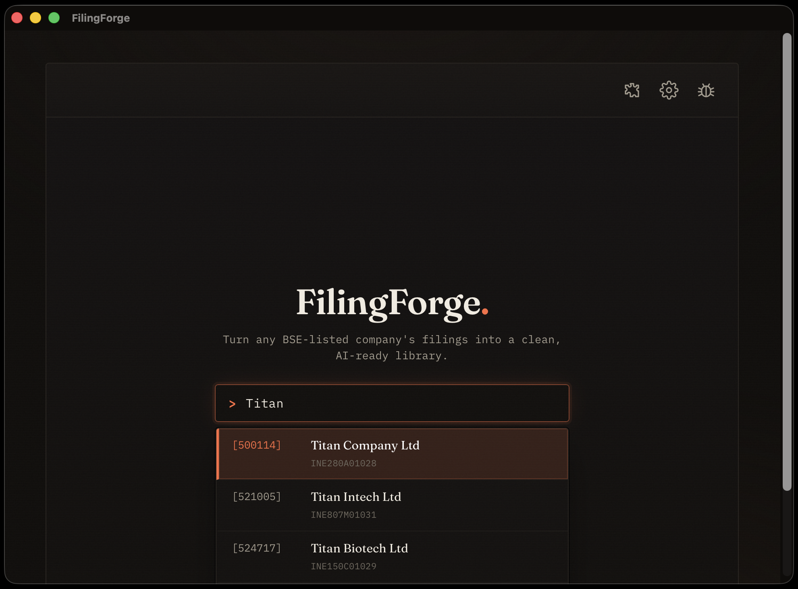
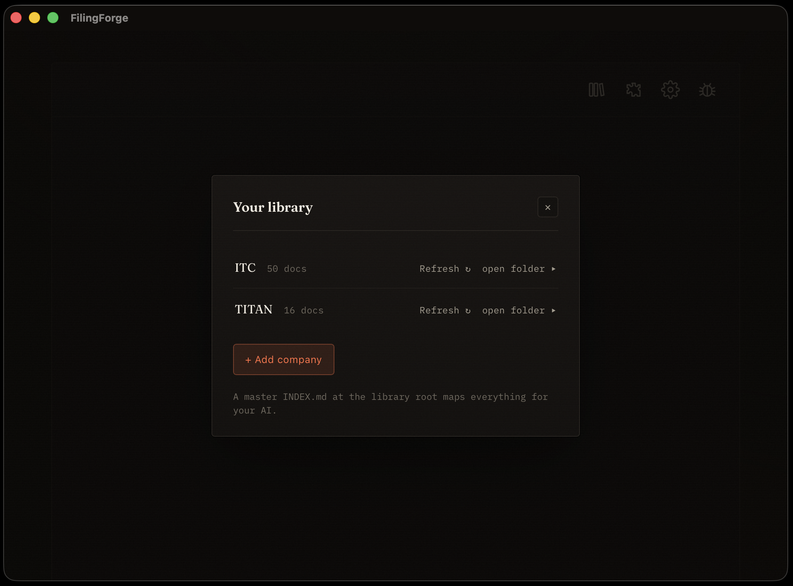
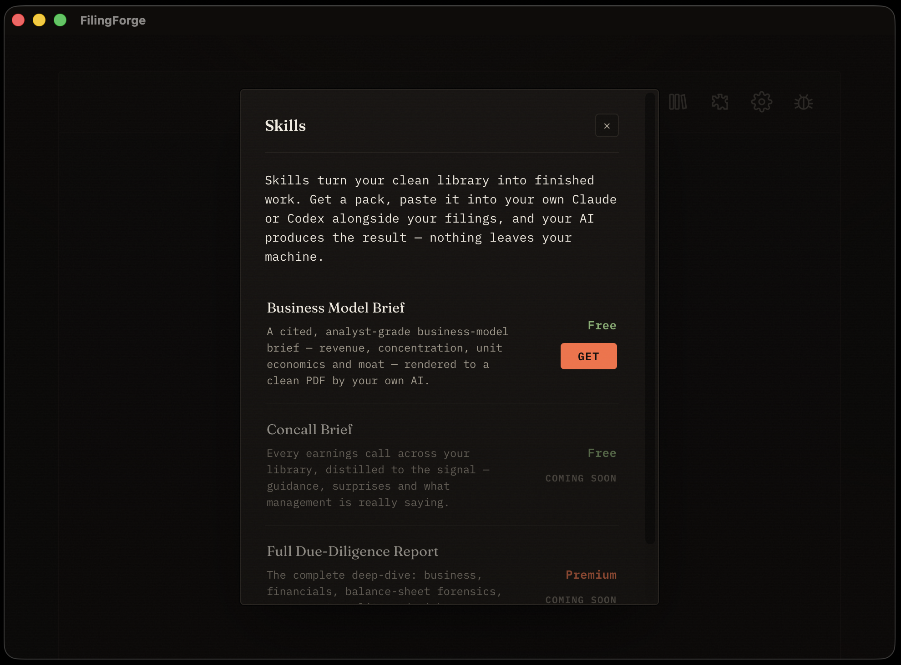

<div align="center">

# FilingForge

**Official filings, as clean Markdown your AI can actually read.**

[](LICENSE)
[](https://github.com/nandanpugalia/FilingForge/releases/latest)
[](#-privacy--local-first)
[](#-install)

*Search any BSE-listed Indian company → pull its official filings → get a clean, AI-ready Markdown library on your own machine.*

</div>

---

## The problem: PDFs are where AI research quietly goes to die

Drop a filing PDF into the Claude desktop app or Codex and the tables collapse into mush, scanned pages become nothing, and you burn thousands of tokens on layout garbage. The model hands you a confident, **wrong** answer — and you never see that the context was broken.

FilingForge fixes the **input**. Every text-based filing becomes clean, structured Markdown, with an `INDEX.md` your AI reads first. Same model, finally fed properly.

```text
  A filing PDF → your AI                  The same filing, FilingForge
  ─────────────────────────               ────────────────────────────
  %PDF-1.4 … /F2 9 0 R                     ## Revenue (₹ cr)
  Revenue 1,2 4 8.3  2 ,1 09.7            | Segment   | FY24  | FY23  |
  (cid:32)(cid:71) [table spans pages]    |-----------|------:|------:|
  running headers, footers, page nums      | Retail    | 1,248 | 1,109 |
  …34,000 tokens of layout noise          | Wholesale |   860 |   740 |
                                           *Source: Annual Report FY24, p.42*
```

> **The download is the easy part. The transformation is the product.**

---

## 📸 Screenshots

**Look up any BSE-listed company — it resolves against the live exchange:**



**Your library — every company, every filing, indexed and AI-ready:**



**Skills — turn the clean library into finished work in your own AI:**



---

## ⬇️ Install

Download the latest build for your platform from **[GitHub Releases](https://github.com/nandanpugalia/FilingForge/releases/latest)**.

Free. No account. Your data never leaves your computer.

### macOS

FilingForge is **Apple-notarized** — download the `.dmg`, drag to Applications, and open it. No quarantine warnings, no workarounds.

### Windows

Windows SmartScreen may warn about an unrecognized publisher. Click **More info → Run anyway**. The installer is a standard per-user NSIS package — no admin rights required.

---

## ⚙️ How it works

One window. Search a company, pick what you want, and it builds the library.

| | | |
|---|---|---|
| **1 · Search** | Type a company. FilingForge finds it on **BSE** and pulls its official filings — annual reports, results, investor presentations, and more. **Annual reports go back to 1997** where BSE has them, including for companies since delisted. | |
| **2 · Convert** | Every PDF becomes a clean `.md` sibling — readable, structured, AI-ready. No PDFs for your model to choke on. | |
| **3 · Index** | A per-company and master `INDEX.md` map every document, so you (or your AI) point at one folder and have everything. | |

The library is laid out **year-wise**, and refreshes are **smart and incremental** — re-run a company and FilingForge pulls only what's new, leaving your existing Markdown untouched.

**Two sources, one library.** BSE's announcements feed only carries annual reports from 2015, when LODR Reg. 34(1) started requiring them. FilingForge also reads BSE's separate annual-report archive, which reaches back to **1997** — so a library covers two decades, not one, and a company that has since delisted keeps its history. Where a report sits in both places it is counted once, and refreshing an existing library adds the older years without re-downloading anything you already have.

> FilingForge converts **text-based** filings (the vast majority of BSE documents) to clean Markdown — deliberately lightweight, no OCR, no GPU. The occasional scanned-image PDF is saved as-is and clearly flagged, so your AI never reads fabricated text.

---

## 🔌 MCP server — let your AI drive the library

FilingForge ships an **MCP server**, so an MCP-aware client (Claude Desktop, Claude Code, and others) can work the library directly instead of you copying files around.

```bash
pip install "filingforge-engine[mcp]"
filingforge-mcp --root ~/FilingForge
```

| Tool | What it does |
|------|--------------|
| `list_companies` | What's in the library, with filing counts |
| `get_index` | A company's `INDEX.md`, or the master index |
| `search_filings` | Find documents by title, narrowed by company / category / year |
| `read_filing` | Returns the **clean Markdown** — never the PDF |
| `pull_company` | Download a company from BSE into the library |
| `refresh_company` | Re-pull one already held, keeping its original categories |

Two deliberate constraints. The **library root is fixed when the server starts**, and every path is resolved and checked against it — a model cannot read outside your library. And `pull_company` **never guesses between similarly-named companies**: an ambiguous name returns the candidates and downloads nothing.

> The MCP extra installs into its own environment — `mcp` 2.x needs a newer Starlette than the desktop app's API pins. Keep them separate.

---

## 🧩 Skills

Skills turn your clean library into finished work.

A Skill is a **prompt-pack you run in the Claude desktop app or Codex**, pointed at your library. **The app never calls an LLM** — nothing about Skills runs on anyone's servers. You bring your own AI; FilingForge gives it clean, cited source material and a precise prompt.

| Skill | What it does | |
|-------|--------------|---|
| **Business Model Brief** | A cited, analyst-grade brief on how the company actually makes money — revenue mix, concentration, unit economics, moat — rendered as a clean, self-contained **interactive HTML report** by your own AI (a coding agent like Claude Code or Codex, which has file access). | **Free** |
| **Concall Decoder** | Every earnings call in your library, decoded — management's guidance track record (kept vs missed), tone shifts, what analysts keep asking, and what management avoids. A cited read on how much to trust the team. | **₹3,000** |

Skills are **one-time purchases** — you download a `.md` file and import it. No subscription, no licence server, no network check to run. The free Skill works identically to paid ones; the difference is what the prompt does.

Everything stays prompt-pack shaped: open, inspectable, and run on your machine with your own model.

---

## 🛠️ Build from source

Building locally also gives you a **no-quarantine** build on macOS.

If you only want the Python engine, start with **[docs/ENGINE.md](docs/ENGINE.md)**.

**Prerequisites**

- **Rust** (stable toolchain) — for Tauri
- **Node 20** — for the UI
- **Python 3.11** — for the engine sidecar

**1 — Python engine + sidecar**

From the repo root, create a virtualenv and install the engine with its API + build extras:

```bash
python3.11 -m venv .venv
source .venv/bin/activate          # Windows: .venv\Scripts\activate
pip install -e ".[api,dev]" pyinstaller
```

Then build the engine into the Tauri sidecar binary:

```bash
python sidecar/build_sidecar.py
```

This produces `ui/src-tauri/binaries/filingforge-api-<target-triple>` (with a `.exe` suffix on Windows), which Tauri bundles as an external binary.

**2 — UI dependencies**

```bash
npm ci --prefix ui
```

**3 — Build the desktop app**

```bash
npm run tauri build --prefix ui
```

The bundled installers land under `ui/src-tauri/target/release/bundle/` (`.dmg` on macOS, NSIS `.exe` on Windows).

> Want a hot-reload dev loop instead? Run `npm run tauri dev --prefix ui` (build the sidecar first so the app can spawn it).

---

## 🏗️ Tech

- **Shell:** [Tauri v2](https://tauri.app) — a small, native desktop window on macOS and Windows.
- **UI:** React + TypeScript (Vite).
- **Engine:** a bundled Python [FastAPI](https://fastapi.tiangolo.com) sidecar, frozen with PyInstaller, that does the downloading, PDF→Markdown conversion, and indexing.
- **Wiring:** the engine binds **loopback only** (`127.0.0.1:8765`) and is spawned by the app as a sidecar process — never `0.0.0.0`, so it's **not exposed to your LAN or the internet** (only local processes on your own machine can reach it, which the [Security policy](SECURITY.md) treats as a threat surface).

---

## 🔒 Privacy / local-first

FilingForge is built to be boring about your data:

- **No account.** Nothing to sign up for.
- **No telemetry.** The app doesn't phone home.
- **No LLM calls.** FilingForge never sends your filings or queries to any model.
- **Your files, your disk.** Filings, Markdown, and indexes all live in a local library folder you control. The only outbound network traffic is fetching public filings from **BSE** and checking **GitHub** for app updates — never your data.

---

## 🤝 Contributing

Issues and pull requests are welcome. See **[CONTRIBUTING.md](CONTRIBUTING.md)** to get started, and please follow the **[Code of Conduct](CODE_OF_CONDUCT.md)**.

## 🛡️ Security

Found a vulnerability? Please report it responsibly — see **[SECURITY.md](SECURITY.md)**.

## 📄 License

MIT — see **[LICENSE](LICENSE)**. © 2026 Nandan Pugalia.

---

## ❤️ Support

FilingForge is free and open-source, built and maintained by one person. If it saves you time, you can support its development via **UPI** from the in-app support screen. Thank you.
